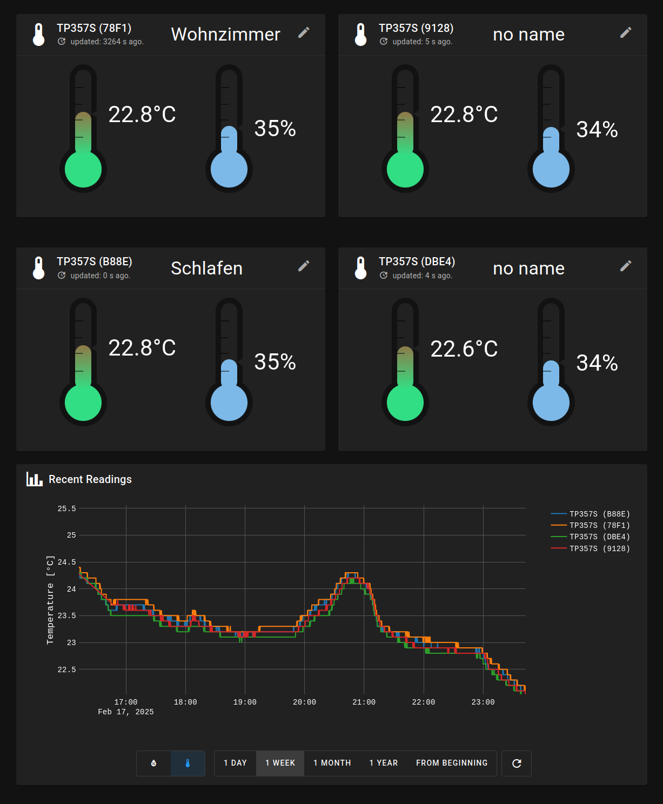
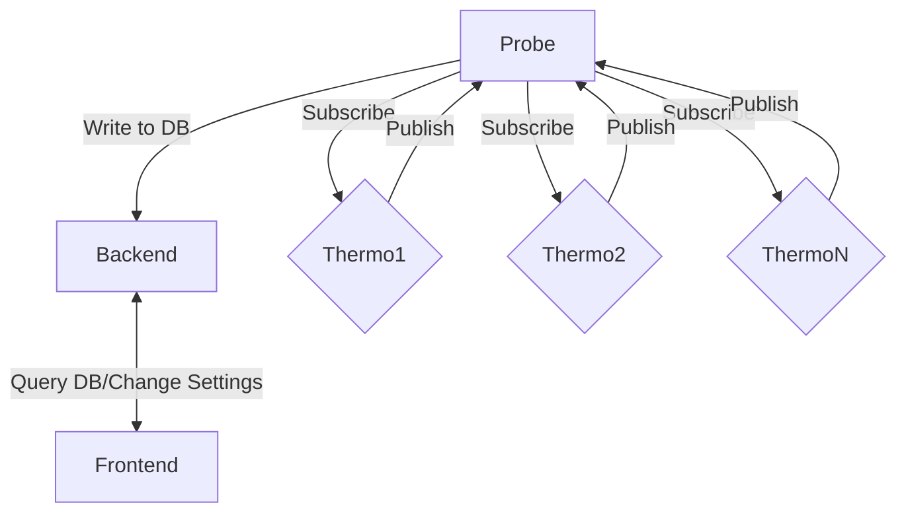

# Thermo Sensor



## Abstract

Just a small collection of programs that does the following:



- **Probe**:
  
  - Look for Bluetooth thermometer devices, that follow certain specifications. The specifications are if their name contains a certain string, and a service with a certain UUID is provided by them.
  
  - Continiously ping them to get the current termperature and humidity and write them to a SQLite db

- **Backend**:
  
  - Provide various ways to query and add to the database

- **Frontend**:
  
  - Display said data
  - Set the description of the devices

Currently the project is configured for the **ThermoPro TP357S** but it's pretty easy to add your own device.

## Installation

You first need to set the envoirement variable BACKEND_IP and BACKEND_PORT in the docker compose file to the ip and port of the device, that is running the backnend:
```yaml
services:
  frontend:
    build:
      context: .
      dockerfile: Dockerfile.node
      args:
        BACKEND_IP: "192.168.179.8" #HERE
        BACKEND_PORT: 8081          #HERE
    image: thermoSensorTS/latest
```

This is needed, so the frontend can acess the backend.
The whole project is dockerized. Since we are using the host's bluetooth, we need a priviledged container. To run it simply use

```shell
docker compose up
```

This should support all docker compose versions from 2.33 to 3.0.


## Configuration

### Overview

If you want to ping the standard device, editing config.toml should be enough. The config consists of a block per program

- **bt_config** (Coniguration for the bluetooth probe ) : This should just be changed if you want to add your own device. Evertyhing is ready for the normal device
  
  - name : Name filter of the device. If the device's name string contains this filter, it's valid
  
  - service uuid: The service that provides temerature and humidty. If the device offers this service it's valid. We'll subscribe to it, and wait for updates. Each update will be send to the database.

- **db_config**(Configuration of the backend)
  
  - file_name: path to the SQLite databser
  
  - backend_ip: You can limit, who is allowed to poll the infomration in the database, please check the [actix-web documentation ](https://actix.rs/)for more information
  
  - backend_port: Port for the backend. If you change this, you'll need to change the mapping in the docker-compose file als well.

### Example impl

```toml
[bt_config]
name = "TP357S"
service_uuid = "urn:uuid:00010203-0405-0607-0809-0a0b0c0d2b10"

[db_config]
file_name = "db/bt_thermo.db"
backend_ip = "0.0.0.0"
backend_port = 8081
```

## Adding your own device

### Overview

For this you need to change the name of the device and the service uuid in config.toml. Furthmore you need to specify how the data is being parsed.

To do this change the function **extract_temp_and_humidity** in bt_data.rs.

This function converts the vec<u8> output of the BT device to temperature and humidity.

## Configuration

You need to configure two things. How your device is called and how the service, that provides temperature and humidty is called. Usually googeling the device will provide you with the fitting uuid of the service. 

### Example impl for reading function

```rust
```fn extract_temp_and_humidity(
    data: Vec<u8>, //output of bluetooth
    name: String,  //device name (used to identify it)
) -> Result<Reading, Box<dyn std::error::Error>> {
    let t = u16::from_le_bytes(data[3..5].try_into()?); //temperature  is encoded as an u16, which are 2 bytes in the devices's response
    let h = data[5]; //humidity is just u8, 1-100% fits into u8
    let now = Utc::now();
    Ok(Reading {
        temperature: t,
        humidity: h,
        device_name: DeviceName{name : name.to_string(), nickname: None},
        time_stamp: now,
    })
}```
```
